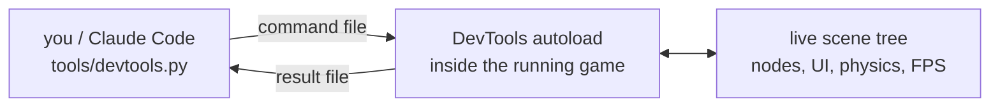

# godot-selftest-harness

**Let Claude Code test your Godot 4 game by actually running it.** Press buttons,
inject input, read node state, screenshot the UI — so an agent can check its own
work instead of just re-reading the diff. It's a plain CLI too, if you'd rather
script it yourself.

A game's interesting behavior only exists at runtime, inside a scene tree someone
has to be watching. This harness puts a wire into the running game so a script can
watch instead.

## How it works

The harness installs an autoload into your game that watches a file for commands
and writes back answers. A Python CLI on the other end writes those files.



No sockets, no ports, no editor. Two JSON files in Godot's `user://` directory.

## Try it

Add this plugin to Claude Code, then run this once inside your Godot project:

```
/scaffold-godot-harness
```

Now Claude can open the game and look. You ask in English; it picks the verbs.

```
> the inventory button doesn't work on phones. can you check?

● Bash(python tools/devtools.py launch)
  ⎿ Launched pid 24188: godot --path . --mute
    bus answered: pid 24188

● Bash(python tools/devtools.py set-feature --touchscreen true)
  ⎿ touchscreen: true

● Bash(python tools/devtools.py reachable-ui)
  ⎿ 2 of 3 interactive control(s) are actually reachable at 1152x648
      /root/Main/HUD/PauseButton "II"  [button] 1080,24 48x48
      /root/Main/HUD/MapButton "Map"  [button] 1080,88 48x48
      /root/Main/HUD/InventoryButton "Bag"  [button] 24,576 48x48
        BLOCKED BY /root/Main/HUD/TouchOverlay

  Found it. TouchOverlay is a full-screen sibling drawn after the button and it
  stops input, so the tap never reaches InventoryButton. It works on desktop
  because the key binding bypasses the UI entirely — which is why the tests pass.
```

Before you commit, `/verify` runs the whole gate: lint, unit tests, then it launches
the game, drives the code you actually changed, and says what it reached and what it
couldn't.

Everything is a plain CLI underneath, so a shell script or CI job can do the same
(`python tools/devtools.py --help`).

## What you get

| | |
|---|---|
| **Drive the game** | key/action/touch input, button presses, spawn and clear nodes, call any method, set any property |
| **Read the game** | node state, scene tree, tilemaps, raycasts, screen pixels, FPS, orphan-node growth |
| **Check the UI** | layout validation, "which controls can a finger actually hit", screenshot diffs against a baseline |
| **Run headless** | lint + unit tests with no display, honest exit codes (`0` pass, `1` findings, `2` couldn't run) |
| **One gate** | `/verify` — lints, tests, launches, drives, and reports before you commit |

The core knows nothing about your game. Game-specific verbs (`spawn_enemy`,
`get_score`) go in a small extension file the scaffolder drops in your project.

## Demo

<!-- Record with: python tools/devtools.py launch --no-mute -- --write-movie demo/frame.png --fixed-fps 30
     or asciinema for the CLI side, then link the result here. -->

_Not recorded yet._

## Requirements

- Godot 4.x (4.6+ recommended)
- Python 3, standard library only
- macOS / Linux / Windows (on Linux and Windows, set `GODOT_BIN` to your Godot executable)

## More

- **[REFERENCE.md](REFERENCE.md)** — the full manual: every verb, every flag, every sharp edge.
- **[PURPOSE.md](PURPOSE.md)** — what the project is committed to, and what it deliberately isn't.
- **[CLAUDE.md](CLAUDE.md)** — how to work in this repo.

Inspired by [tea-leaves](https://github.com/cleak/tea-leaves), adapted to Godot.

> Command blocks say `python`. Where only `python3` exists, use that — but on Windows
> probe by *executing* it, since the Microsoft Store's `python3` stub passes
> `command -v` and then refuses to run.
