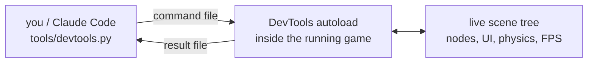

# godot-selftest-harness

**Point it at your running Godot 4 game and it tells you what's wrong.** Controls
sitting outside the viewport, a button nothing can actually tap, signals declared
and never connected, nodes leaking run over run. You write no assertions.

```
> python tools/devtools.py findings

7 finding(s) across 5 of 5 checks (1152x648)
  ui_offscreen                3  [ERROR] ui_layout
      /root/Main/HUD/ComboLabel: outside the viewport at 1204,88 (viewport 1152x648)
      ...
  ui_zero_size                1  [ERROR] ui_layout
      /root/Main/HUD/ScorePanel: Control has zero size (0x0)
  signal_unconnected          2  [WARN] signal_unconnected
      /root/Main/Player: signal 'died' is declared and has 0 connections
      /root/Main/Spawner: signal 'wave_cleared' is declared and has 0 connections
  unreachable_control         1  [WARN] ui_reachable
      /root/Main/HUD/InventoryButton: BLOCKED BY /root/Main/HUD/TouchOverlay

By check: performance=0, scene_validation=0, signal_unconnected=2, ui_layout=4, ui_reachable=1

All checks ran.
UI baseline: none on disk - every ui_layout finding gates.
```

None of that came from a test someone wrote. It's a checklist of the ways Godot
games actually break, accumulated from real failures and run against your live
scene tree.

## Why not just write a test suite?

You should — and Claude will, whether or not you ask. The problem isn't that those
tests are bad. It's that **a suite you wrote can only check what you already thought
of.** "70 checks, 0 failures" is what a thorough suite and a suite with a blind spot
both print.

So the harness also reports on your *checks*, not just their results:

```
> python tools/coverage_check.py

This project asserts 70 things across 3 test files.
5 of 8 defect classes are never exercised:

  UNCHECKED  ui_layout      nothing ever reads a Control's screen rect or size
  UNCHECKED  ui_reachable   nothing asks whether a Control can actually be hit
  COVERED    orphan_growth  test/unit/test_leaks.gd:22  Performance.get_monitor(...)
```

That's the thing a hand-rolled suite structurally cannot do: notice what it forgot.

## Install

In Claude Code:

```
/plugin marketplace add SeveralHerr/godot-selftest-harness
/plugin install godot-selftest-harness@godot-selftest-harness
```

Then run this once inside your Godot project:

```
/scaffold-godot-harness
```

Then `/verify` before you commit. It runs the name, import, lint and unit-test
gates, launches the game, runs the findings report, drives the code you actually
changed, and tells you what it reached and what it couldn't.

The checks you write go in `test/unit/test_selftest.gd` and are re-run on every
change from then on — so the next session inherits them instead of starting over.

## When you need to drive the game

Underneath the findings report is a file-based bridge into the running game: an
autoload watches a JSON file for commands and writes back answers, and a Python CLI
on the other end writes those files. No sockets, no ports, no editor.



Use it when the report isn't enough and you need to reproduce something specific —
press a button, hold an input for two seconds, set a property, read a node back:

```
> the inventory button doesn't work on phones. can you check?

● Bash(python tools/devtools.py set-feature --touchscreen true)
  ⎿ touchscreen: true

● Bash(python tools/devtools.py reachable-ui)
  ⎿ 2 of 3 interactive control(s) are actually reachable at 1152x648
      /root/Main/HUD/InventoryButton "Bag"  [button] 24,576 48x48
        BLOCKED BY /root/Main/HUD/TouchOverlay

  TouchOverlay is a full-screen sibling drawn after the button and it stops
  input, so the tap never reaches InventoryButton. It works on desktop because
  the key binding bypasses the UI entirely — which is why the tests pass.
```

There are ~48 verbs; ten of them are most of the use. `REFERENCE.md` has all of
them, `list-commands` discovers them at runtime, and it's a plain CLI, so a shell
script or CI job can do the same (`python tools/devtools.py --help`).

## What you get

| | |
|---|---|
| **Findings, zero config** | `findings` — offscreen and zero-size Controls, unreachable buttons, unconnected signals, orphan growth, scene validation, in one call |
| **Coverage of your checks** | `coverage_check.py` — which classes of defect this project's tests never ask about |
| **Run headless** | name resolution, import, lint (incl. every shader), unit tests — no display, honest exit codes (`0` pass, `1` findings, `2` couldn't run) |
| **Drive the game** | key/action/touch input, button presses, spawn and clear nodes, call any method, set any property |
| **Read the game** | node state, scene tree, tilemaps, raycasts, screen pixels, screen-space bounds, 3D AABBs |
| **One gate** | `/verify` — gates, launches, drives, reports, and records the run before you commit |

The core knows nothing about your game. Game-specific verbs (`spawn_enemy`,
`get_score`) go in a small extension file the scaffolder drops in your project.

## Requirements

- Godot 4.x (4.6+ recommended)
- Python 3, standard library only
- macOS / Linux / Windows (on Linux and Windows, set `GODOT_BIN` to your Godot executable)

## More

- **[REFERENCE.md](REFERENCE.md)** — the full manual: every verb, every flag, every sharp edge.
- **[PURPOSE.md](PURPOSE.md)** — what the project is committed to, and what it deliberately isn't.
- **[CLAUDE.md](CLAUDE.md)** — how to work in this repo.

Inspired by [tea-leaves](https://github.com/cleak/tea-leaves), adapted to Godot.

> Command blocks say `python`. Where only `python3` exists, use that — but on Windows
> probe by *executing* it, since the Microsoft Store's `python3` stub passes
> `command -v` and then refuses to run.
